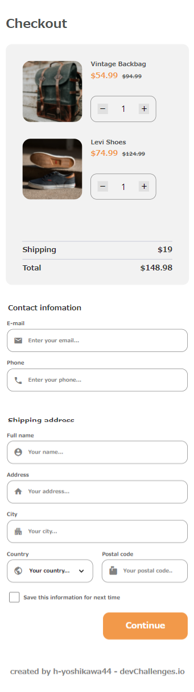

<!-- Please update value in the {}  -->

<h1 align="center">Checkout Page</h1>

<div align="center">
   Solution for a challenge from  <a href="http://devchallenges.io" target="_blank">Devchallenges.io</a>.
</div>

<div align="center">
  <h3>
    <a href="https://h-yoshikawa44.github.io/ch-checkout-page/">
      Demo
    </a>
    <span> | </span>
    <a href="https://devchallenges.io/solutions/SFmxGtHXWkESKZbSrg67">
      Solution
    </a>
    <span> | </span>
    <a href="https://devchallenges.io/challenges/0J1NxxGhOUYVqihwegfO">
      Challenge
    </a>
  </h3>
</div>

<!-- TABLE OF CONTENTS -->

## Table of Contents

- [Table of Contents](#table-of-contents)
- [Overview](#overview)
  - [Desktop](#desktop)
  - [Mobile](#mobile)
  - [Built With](#built-with)
- [Features](#features)
- [How To Use](#how-to-use)
- [learned/improved](#learnedimproved)
- [Acknowledgements](#acknowledgements)
- [Contact](#contact)

<!-- OVERVIEW -->

## Overview
### Desktop


### Mobile


### Built With

<!-- This section should list any major frameworks that you built your project using. Here are a few examples.-->

Base
- [HTML](https://developer.mozilla.org/ja/docs/Web/HTML)
- [CSS](https://developer.mozilla.org/ja/docs/Web/CSS)
- [JavaScript](https://developer.mozilla.org/ja/docs/Web/JavaScript)
- [Node.js](https://nodejs.org/)：16.13.0
- [Vite](https://ja.vitejs.dev/)：2.6.4

Other major libraries
- [material-design-icons](https://google.github.io/material-design-icons/)
- [focus-visible](https://github.com/WICG/focus-visible)

※As for the form validation, it is done using HTML only.  
※The pattern validation for Phone and Postal code is based on Japanese specifications.

## Features

<!-- List the features of your application or follow the template. Don't share the figma file here :) -->

This application/site was created as a submission to a [DevChallenges](https://devchallenges.io/challenges) challenge. The [challenge](https://devchallenges.io/challenges/0J1NxxGhOUYVqihwegfO) was to build an application to complete the given user stories.

- [x] User story: I can see a page following the given design
- [x] User story: I can input email, phone, full name, address, city, country, and postal code
- [x] User story: I can input the number of items
- [x] User story: I can select at least 3 countries from the dropdown
- [x] User story: When I click submit button or press enter, I can see a warning if validation fails
- [x] User story: When I click submit button or press enter, I can see a successful alert if validation succeeds

## How To Use

To clone and run this application, you'll need [Git](https://git-scm.com) and [Node.js](https://nodejs.org/en/download/) (which comes with [npm](https://www.npmjs.com/)) installed on your computer. From your command line:

```bash
# Clone this repository
git clone https://github.com/h-yoshikawa44/ch-checkout-page.git
or
git clone git@github.com:h-yoshikawa44/ch-checkout-page.git

# Install dependencies
npm install

# Run the Vite
npm run dev
```

## learned/improved
- about the different types of autocomplete.
- Validation Processing in HTML.
- Input type="tel" in iOS Safari allows only numbers.

## Acknowledgements

<!-- This section should list any articles or add-ons/plugins that helps you to complete the project. This is optional but it will help you in the future. For exmpale -->

- [MDN - input: 入力欄 (フォーム入力) 要素](https://developer.mozilla.org/ja/docs/Web/HTML/Element/input)
- [MDN - クライアント側のフォームデータ検証](https://developer.mozilla.org/ja/docs/Learn/Forms/Form_validation)
- [Twitter - @pulpxstyle - ユーザーに優しいオートコンプリート](https://twitter.com/pulpxstyle/status/1459491270833807362?s=20)
- [HTML5におけるinput要素のpattern、type属性のおさらい](https://qiita.com/ka215/items/795a179041c705bef03b)
- [【JavaScript】桁指定して四捨五入・切り上げ・切り捨て](https://qiita.com/nagito25/items/0293bc317067d9e6c560)

## Contact

- Website：[h-yoshikawa44.com](https://h-yoshikawa44.com)
- GitHub：[@h-yoshikawa44](https://github.com/h-yoshikawa44)
- Twitter：[@yoshi44_lion](https://twitter.com/yoshi44_lion)
